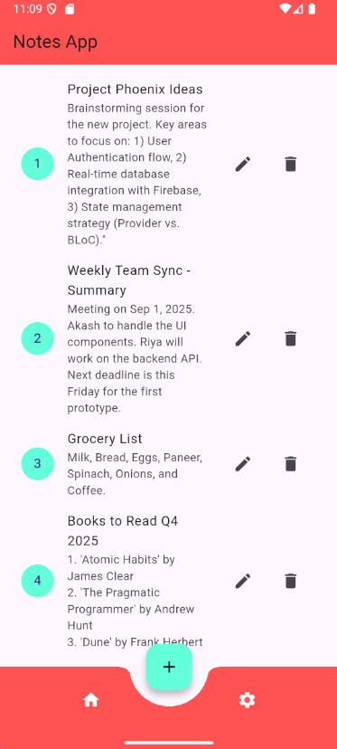
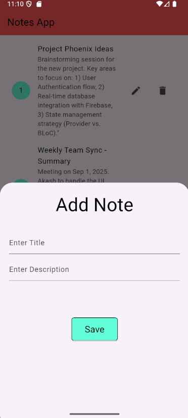
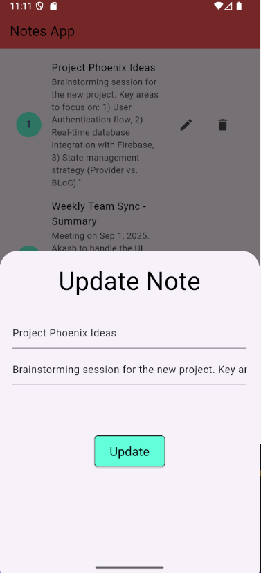

# Flutter Notes App (MongoDB REST Backend)

A simple Flutter app to create, read, update, and delete notes via a REST API backed by MongoDB. The UI is built with Material widgets and communicates with a backend using the `http` package.

## Features
- **List notes** with index avatars
- **Add** and **update** notes using a bottom sheet form
- **Delete** notes with a single tap
- **Empty state** illustration when no notes exist
- **Bottom app bar** with a centered Floating Action Button (FAB)

## Tech Stack
- **Flutter** (Dart SDK 3.8.x)
- **http** package for REST calls
- **MongoDB** (via your own backend API)

## Project Structure (key files)
- `lib/main.dart` — App entry, sets `Homescreen` as home
- `lib/homeScreen.dart` — UI: list, bottom sheet for add/edit
- `lib/mongo.dart` — Service layer for API calls (GET/POST/PUT/DELETE)
- `assets/images/note.png` — Empty state image

## Prerequisites
1. **Flutter SDK** 3.8.x installed and configured
2. **Running backend API** exposing:
   - `GET /notes`
   - `POST /notes`
   - `PUT /notes/{id}`
   - `DELETE /notes/{id}`
   Each note should have fields: `id`, `title`, `description` (see API Contract below).
3. **Emulator/Simulator/Device** set up

## Configuration
Update the backend URL in `lib/mongo.dart`:

```dart
class MongoService {
  static const baseURL = "http://10.0.2.2:8000"; // Android emulator loopback to host
}
```

- **Android Emulator**: use `http://10.0.2.2:<port>` to reach your host machine
- **iOS Simulator**: use `http://localhost:<port>`
- **Physical Devices**: use your machine's LAN IP (e.g., `http://192.168.1.10:<port>`), same network required


## Getting Started
1. Clone the repo
2. Install dependencies
   ```bash
   flutter pub get
   ```
3. Configure `baseURL` in `lib/mongo.dart`
4. Ensure your backend is running and reachable
5. Run the app
   ```bash
   flutter run
   ```

## UI Usage
- Tap the **+ FAB** to add a note
- Tap the **edit** icon to update a note
- Tap the **delete** icon to remove a note

## Screenshots

<table>
  <tr>
    <td align="center">
      <br>
      <sub>Home</sub>
    </td>
    <td align="center">
      <br>
      <sub>Add Task</sub>
    </td>
    <td align="center">
      <br>
      <sub>Update Task</sub>
    </td>
  </tr>
</table>

## API Contract (Expected by the App)
- **GET /notes** → `200 OK`
  ```json
  [
    { "id": "<string>", "title": "<string>", "description": "<string>" }
  ]
  ```
- **POST /notes** → `200 OK`
  - Request body:
    ```json
    { "title": "<string>", "description": "<string>" }
    ```
  - Response body (recommended):
    ```json
    { "id": "<string>", "title": "<string>", "description": "<string>" }
    ```
- **PUT /notes/{id}** → `200 OK`
  - Request body:
    ```json
    { "title": "<string>", "description": "<string>" }
    ```
- **DELETE /notes/{id}** → `200 OK`


## Troubleshooting
- **No notes showing / network errors**:
  - Verify the backend is running and reachable at `baseURL`
  - On Android emulator, confirm `10.0.2.2` is used (not `localhost`)
  - On physical devices, use your computer's LAN IP and ensure same Wi‑Fi
  - Ensure backend allows HTTP (or use HTTPS) and CORS if needed
- **ID field mismatch**:
  - App expects `id`. If backend uses `_id`, either map it on the server or adjust the client code where `id` is read/used.
- **HTTP 403/ATS on iOS**:
  - Add App Transport Security exceptions or serve over HTTPS

## Commands
```bash
flutter pub get
flutter run -d chrome     # Web (if backend CORS allows)
flutter run -d emulator-5554  # Android emulator
```

## License
Add your preferred license here (e.g., MIT).

## Author
Akash Kumar Verma
---
